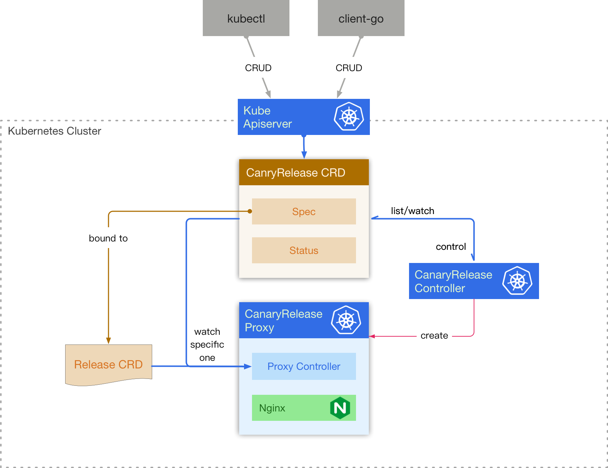
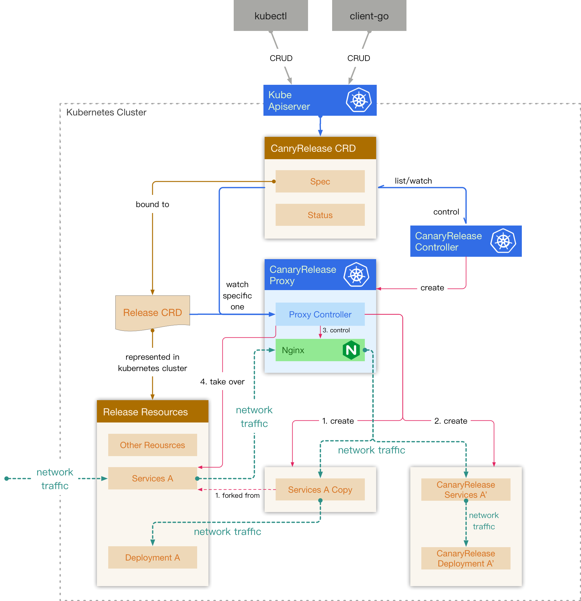
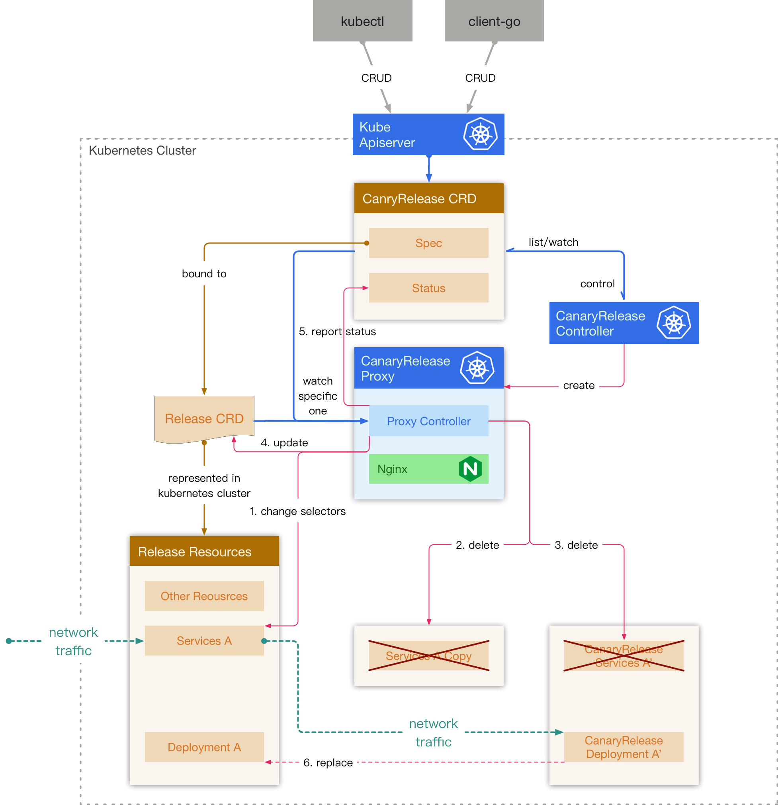
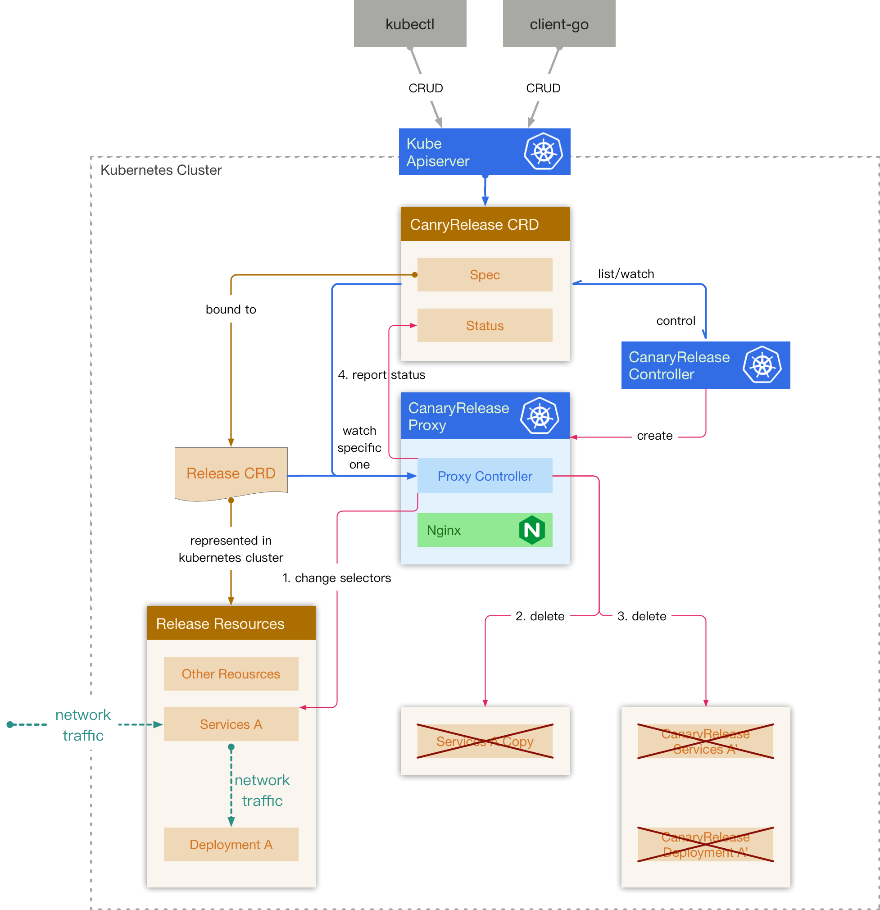

# CanaryRelease controller

This document describes an implementation of canary release system based on [Rudder](https://github.com/caicloud/rudder)

## Goal

1.  Support network traffic distribution according to the weight
2.  Be transparent to the user

## Architecture



First of all, we introduce one new `Custom Resource Definition` - `CanaryRelease` and two new components `CanaryRelease Controller` and `CanaryRelease Proxy`.

### Custom Resource Definition

#### CanaryRelease

A `CanaryRelease` contains: 

-   a specific `Release` version 
-   a canary release configuration used to generate canary release manifest
-   a services config indicate how to distribute network traffic

### Components

#### CanaryRelease Controller

A canary release controller watches `CanaryRelease CRDs` in kubernetes cluster.

When a new `CanaryRelease CRD` is created, controller creates a `CanaryRelease Proxy` to handle the specific CRD.

When user delete the `CanaryRelease CRD`, controller delete the related `CanaryRelease Proxy`

All business logic is done in `CanaryRelease Proxy`.

#### CanaryRelease Proxy

A canary release proxy contains two components: 

-   a small kubernetes controller watching only one specific `CanaryRelease CRD` and `Release CRD`  


-   a nginx

To a certain extent, it is a bit like the `Ingress Controller`.

**When a `CanaryRelease Proxy` is created**

As shown in the picture below (red line), the controller:

1.  creates new services containing contents of services in `Release`
2.  creates canary release services and canay release resources in mainifest, e.g deployments
3.  generates nginx config, and start nginx process
4.  takes over the original services in `Release`, and lets all network traffics distributed to the nginx. As shown in the picture below (green dashed line):



**When user wants to adopt this `CanaryRelease`**

As shown in the picture below, the controller:

1.  changes original services' selectors in `Release` to let all network traffics distributed to the CanaryRelease Resources, e.g Deployments.
2.  deletes original services' copies
3.  deletes canary release services
4.  applies canary release changes to `Release`
5.  reports status in `CanaryRelease`

Finally `Release Controller` will adopt canary release' resources to replace its own resources in manifest



**When user wants to deprecate this `CanaryRelease`**

As shown in the picture below, the controller:

1.  reverts the original services in `Release`
2.  deletes original services' copies
3.  deletes all canary release services and resources
4.  report status in `CanaryRelease` if needed

For the end users, it is just like nothing had happened.



### CanaryRelease and HPA

One thing that's worth mentioning is the relationship between weight and HPA. Weight and HPA are orthogonal in the design, you have run a separate HPA for your new service if you want to increase its wight, while also scaling up the new service.

## API Definition

```go
// CanaryRelease describes a cannary release
// which providers cannary release for applications.
type CanaryRelease struct {
	metav1.TypeMeta `json:",inline"`
	// +optional
	metav1.ObjectMeta `json:"metadata,omitempty"`
	// Specification of the desired behavior of the CanaryReleaseSpec
	Spec CanaryReleaseSpec `json:"spec,omitempty"`
	// Most recently observed status of the CanaryReleasepec
    // there is no detail because stauts is not universal
	Status CanaryReleaseStatus `json:"status,omitempty"`
}

// CanaryReleaseSpec describes the basic info of a canary release
type CanaryReleaseSpec struct {
	// Release is the name of release TPR associated with this CanaryRelease
	Release string `json:"release"`
	// Version is the version  of release TPR associated with this CanaryRelease
	Version int32 `json:"version"`
	// Path is the path of sub app which needs Canary release
	Path string `json:"path"`
	// Config is the sub config for parsing template, aka Value
	Config string `json:"config"`
	// Service is an array of services in current release node
	Service []CanaryService `json:"services,omitempty"`
	// Resources specify cpu/memory usage of current canary release
	Resources apiv1.ResourceRequirements `json:"resources,omitempty"`
	// Transition is the next phase this CanaryRelease needs to transformed into
	Transition CanaryTrasition `json:"transition,omitempty"`
}

// CanaryTrasition specify the next phase this canary release want to be
type CanaryTrasition string

const (
	// CanaryTrasitionNone is the default value of  trasition
	CanaryTrasitionNone CanaryTrasition = ""
	// CanaryTrasitionAdopted means that this canary release should be adopted
	CanaryTrasitionAdopted CanaryTrasition = "Adopted"
	// CanaryTrasitionDeprecated means that this canary release should be deprecated
	CanaryTrasitionDeprecated CanaryTrasition = "Deprecated"
)

// CanaryService describes a config of a service from release node
type CanaryService struct {
	// Service is the name of the service
	Service string `json:"service,omitempty"`
	// Ports contains an array of port configs
	Ports []CanaryPort `json:"ports,omitempty"`
}

// CanaryPort defines protocol and usable config for a serviec port
type CanaryPort struct {
	// Port is the port number
	Port int32 `json:"port,omitempty"`
	// Protocol is the protocol used by the port
	Protocol Protocol `json:"protocol,omitempty"`
	// Config is the port proxy option
	Config CanaryConfig `json:"config,omitempty"`
}

// Protocol is the network type for ports
type Protocol string

const (
	ProtocolHTTP  Protocol = "HTTP"
	ProtocolHTTPS Protocol = "HTTPS"
	ProtocolTCP   Protocol = "TCP"
	ProtocolUDP   Protocol = "UDP"
)

// CanaryConfig describes a proxy config for a service port
type CanaryConfig struct {
	// Weight is the only proxy config now. The value of weight should be [1,100].
	Weight *int32 `json:"weight,omitempty"`
}
```
